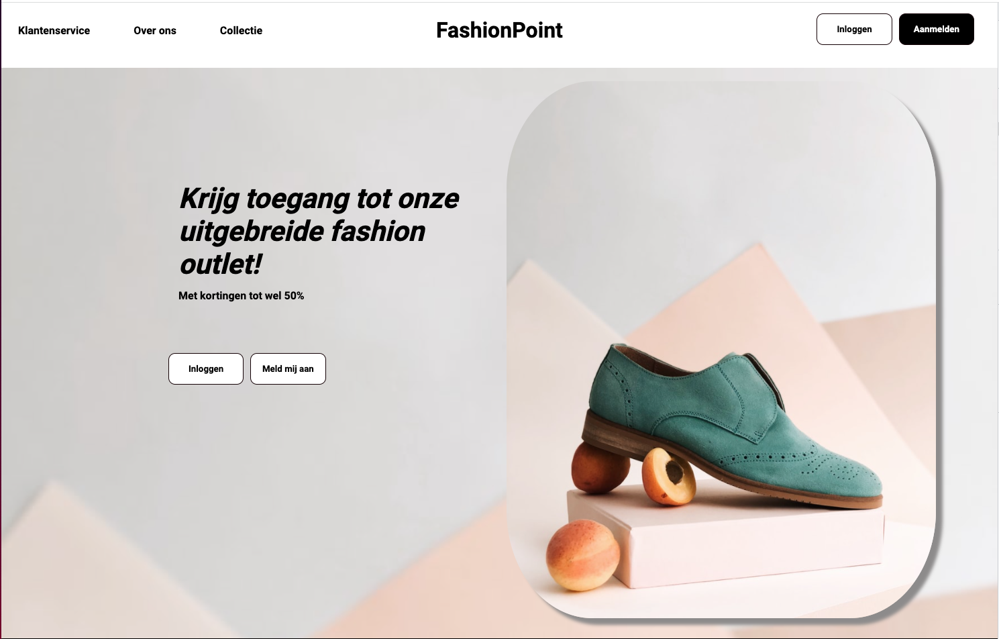

<details>
  <summary>Table of Contents</summary>
  <ol>
    <li>
      <a href="#about-the-project">About The Project</a>
      <ul>
        <li><a href="#built-with">Built With</a></li>
      </ul>
    </li>
    <li>
      <a href="#getting-started">Getting Started</a>
      <ul>
        <li><a href="#prerequisites">Prerequisites</a></li>
        <li><a href="#installation">Installation</a></li>
      </ul>
    </li>
    <li><a href="#roadmap">Roadmap</a></li>
    <li><a href="#contact">Contact</a></li>
  </ol>
</details>

## About The Project



FashionPoint has been build as a React Frontend school Project.
The project is based on the FakeStoreAPI where E-commerce data comes from.
The idea has been to make an as complete as possible Frontend only E-commerce storeview.

- Authentication, this includes:
  - Login with Google / Facebook
  - Login with Email
  - Password reset emails
- Functional Cart
- Functional Wishlist
- Checkout Emulation
- Category sorter
- Dynamic breadcrumbs
- Protected / Private routing
- Responsive

_Note, all data is stored and manipulated in the localStorage, since there is no backend for this project._

<p align="right">(<a href="#top">back to top</a>)</p>

### Built With

This project has been build in:

_Main technologies used_

- [React.js](https://reactjs.org/)
- [Create React App](https://create-react-app.dev/)
- [FakeStoreAPI](https://fakestoreapi.com/)
- [Firebase](https://firebase.google.com/)

_Used NPM packages_

- [ReactDatepicker](https://github.com/Hacker0x01/react-datepicker)
- [Axios](https://github.com/axios/axios)
- [ReactIcons](https://react-icons.github.io/react-icons/)
- [ReactIntersectionObserver](https://github.com/thebuilder/react-intersection-observer)
- [ReactLoadingSkeleton](https://github.com/dvtng/react-loading-skeleton)

<p align="right">(<a href="#top">back to top</a>)</p>

## Getting Started

To get FashionPoint up and running, please follow the instructions below.

### Prerequisites

Make sure npm is running on your machine.

- npm
  ```sh
  npm install npm@latest -g
  ```

### Installation

1. Clone the repo
   ```sh
   git clone https://github.com/Jspek007/fashionPoint
   ```
2. Install NPM packages
   ```sh
   npm install
   ```
3. Get the secret environment details from the provided documentation

4. Create the .env.local file in the root directory. The file should look like the following:

   ```js
   REACT_APP_API_KEY=****************************
   REACT_APP_AUTH_DOMAIN=****************************
   REACT_APP_PROJECT_ID=****************************
   REACT_APP_STORAGE_BUCKET=****************************
   REACT_APP_MASSAGING_SENDER_ID=****************************
   REACT_APP_APP_ID=****************************
   ```

   _Stars will be replaced by the actual value of the field_

5. Run `npm start` to start the application.

6. A test user has been made to instatly have an account available: 
   Username: Testusernovi@gmail.com
   Password: Test123!
   
_Or it is possible to create your own account through the signup section of the application_

<p align="right">(<a href="#top">back to top</a>)</p>

## Roadmap

- [x] Add ReadMe with installation instructions
- [x] Implement searchbar
- [ ] Implement layered navigation
- [ ] Security enhancements
- [ ] Checkout optimalisation

<p align="right">(<a href="#top">back to top</a>)</p>

## Contact

Johan Spekman - [LinkedIn](https://www.linkedin.com/in/johan-spekman/) - Johanspekman@gmail.com

Project Link: [https://github.com/Jspek007/fashionPoint](https://github.com/Jspek007/fashionPoint)

## Happy shopping!

<p align="right">(<a href="#top">back to top</a>)</p>
